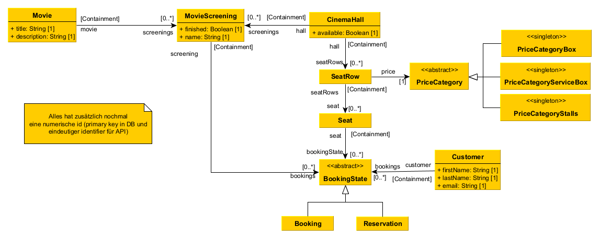

# iis-2-cinema-managament

## Repository Structure:

- [client](/src/client/IIS.Client)
- [MPS model](/src/server/mps-model)
- [Java cinema server workspace](/src/server/java/Server)
- [Java cinema server application source](/src/server/java/Server/Server-Api/src/main/java/IIS/Server)
- [Java cinema server application isolation layer](/src/server/java/Server/Server-Api/src/main/java/IIS/Server/management)
- [Java cinema server application Spring API](/src/server/java/Server/Server-Api/src/main/java/IIS/Server/api)

## DB: 

 - MySQL

## Server:

- Spring [MVC + JSON](https://www.geeksforgeeks.org/spring-rest-json-response/) für REST API
- MPS for persistence

## Client:

- C#/.NET 7 CLI application (`System.CommandLine`)

## Fragen:

- Client als richtige CLI anwendung, oder nur mocken? C# ist fine, aber mit CLI parser.
- Ist Transaktionssicherheit mit Hibernate okay, oder *muss* das der MPS kram sein? MPS zumindest versuchen
- Schrifliche ausarbeitung (LaTeX, Deutsch oder Englisch)? LaTeX englisch ist fine.
- Java version vorgegeben oder uns überlassen? (genauso mit IDE)? Egal.

## Rest API endpoints:

- [global API constants](/docs/md/api-global.md)
- [request model](/docs/md/api-requests.md)
- [response model](/docs/md/api-responses.md)
